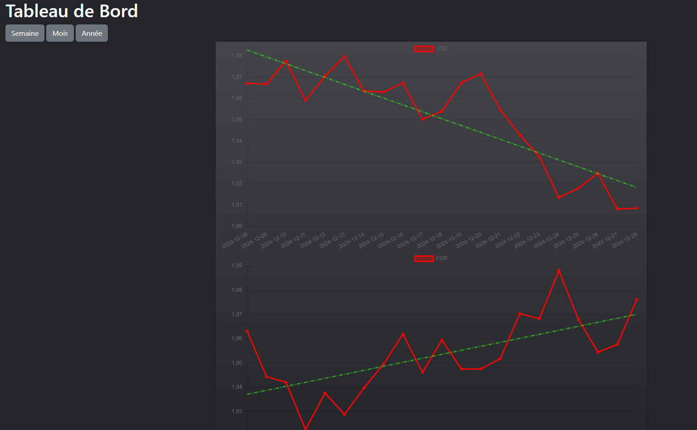

# Dashboard_Currency

A Django web application that visualizes currency exchange rates with a trendline.

---

### Description

A website with Django, Django RestFramework and Chart.js.

The application fetches real-time currency data from a public API and displays the exchange rates in an interactive chart.
(The API delivers fabricated exchange rate data, not real-time information.)

---

### Run the Project

1. `pip install -r requirement.txt`
2. `py manage.py runserver`

---

### How to use

---

Inspired from the Udemy course of Houdon Thibault (Python : La Formation Complète 2024)
